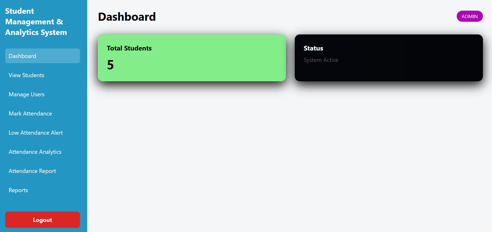
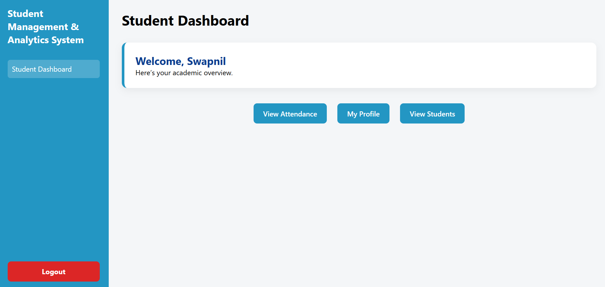

# 🎓 Student Management & Analytics System

A full-stack web application built using **Flask** to manage students, attendance tracking, analytics, and automated reporting with role-based authentication.

---

## 🚀 Key Features

### 👨‍🏫 Admin Panel
- Add / Edit / Delete Students  
- Manage Users (Admin & Student roles)  
- Mark Daily Attendance  
- Attendance Reports by Date  
- Low Attendance Detection (<75%)  
- Analytics Dashboard with Charts  
- Export Reports as **PDF** & **Excel**

### 🎓 Student Panel
- Secure Login System  
- View Student Profile  
- Check Attendance Percentage  
- View Attendance History  
- Personal Dashboard

---

## 🔐 Authentication System
- Role-Based Login (Admin / Student)
- Password Hashing for Security
- Forgot Password Recovery
- Google OAuth Login Integration

---

## 📊 Analytics & Reports
- Branch-wise Student Distribution
- Present vs Absent Visualization
- Attendance Trend Analysis
- PDF Report Generation
- Excel Data Export

---

## 🛠 Tech Stack

| Technology | Usage |
|------------|------|
| **Python (Flask)** | Backend Framework |
| **SQLite** | Database |
| **HTML / CSS** | Frontend |
| **Chart.js** | Analytics Charts |
| **ReportLab** | PDF Reports |
| **OpenPyXL** | Excel Export |

---

## ▶ How to Run Locally

```bash
git clone https://github.com/jarvissi18/Student-Management-Analytics-System
cd Student-Management-Analytics-System
pip install -r requirements.txt
python app.py
```

Open in browser:  
👉 http://127.0.0.1:5000

---

## 🔒 Security

Sensitive credentials (API keys, OAuth secrets) are stored using **environment variables** and excluded from version control.

---

## 👨‍💻 Author

**Swapnil Suryawanshi**  
Computer Engineering Student  
Passionate about Backend Development & Data Systems

---

## 📸 Application Screenshots

### 🔐 Login Page


### 🎛 Admin Dashboard


### 👨‍🎓 Student Dashboard


### 📊 Attendance Analytics


### 📄 PDF / Excel Report Export

